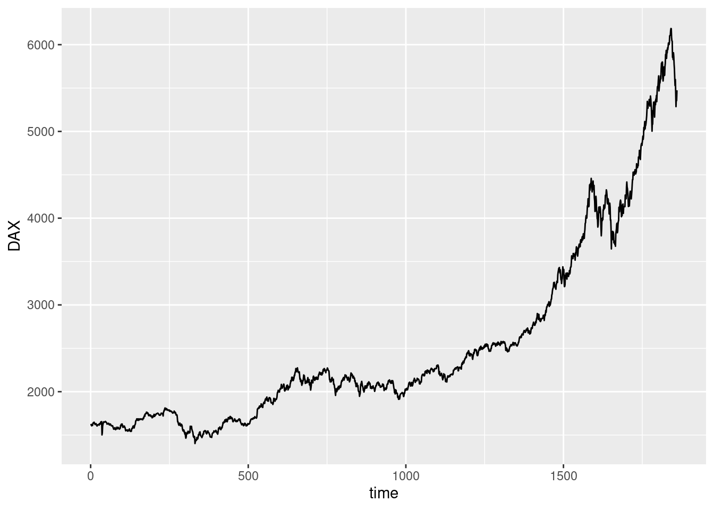
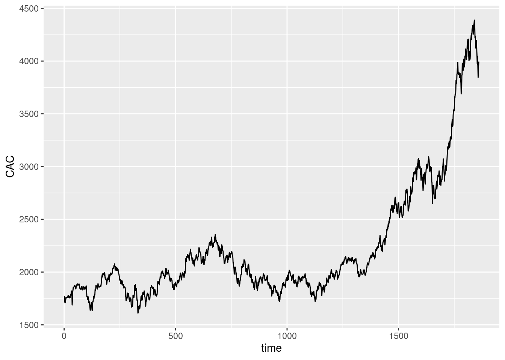
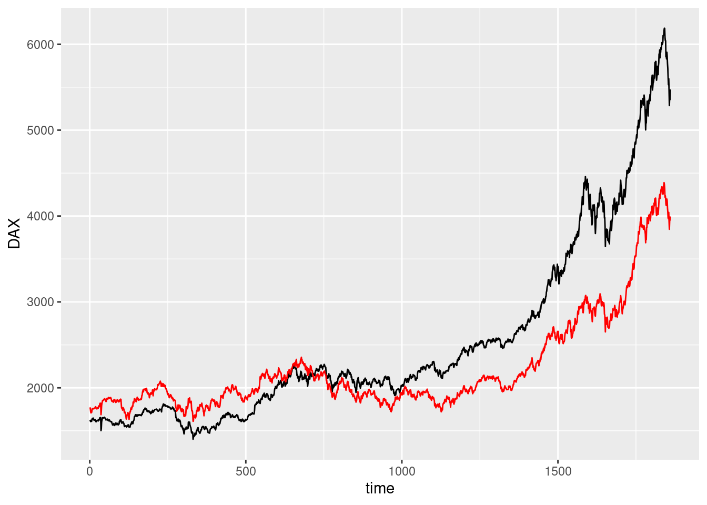
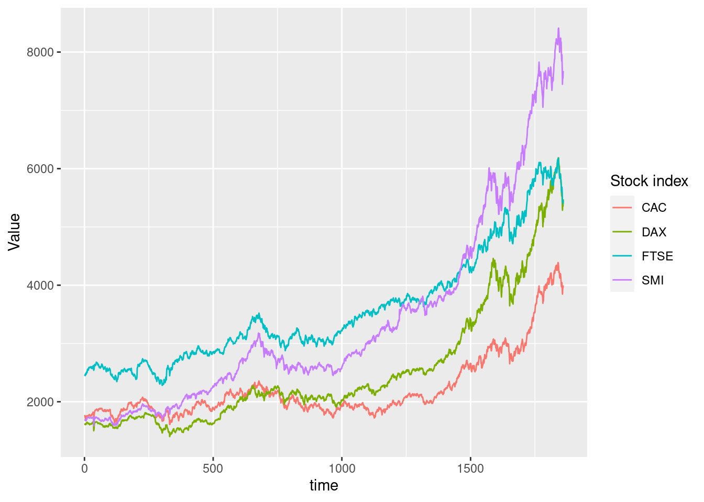
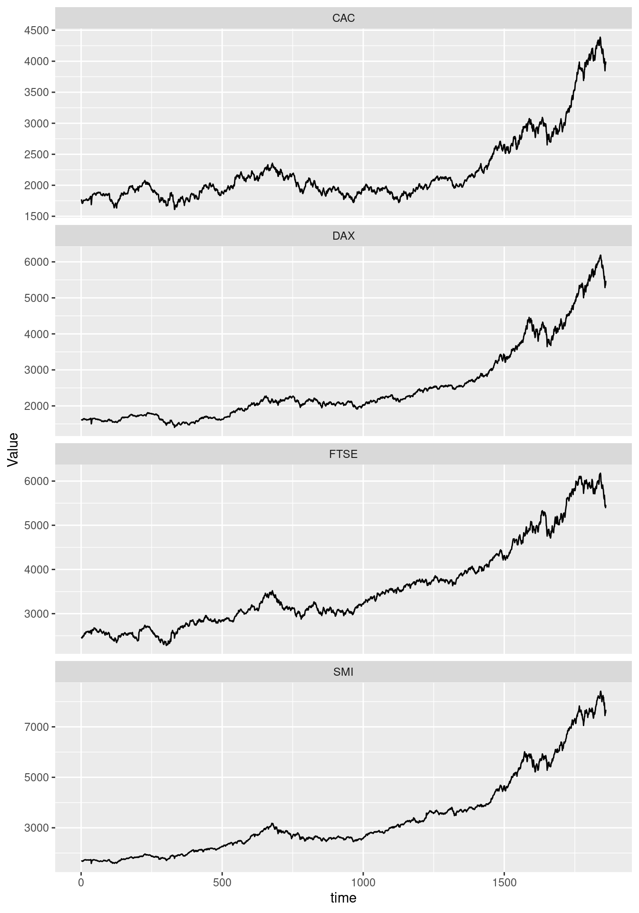

## Tidyr and ggplot2


::: {.cell}

```{.r .cell-code}
here::i_am("git-r-101.Rproj")
library(here)
library(ggplot2)
library(dplyr)
library(tidyr)
```
:::


### Multiple lines on a single graph


::: {.cell}

```{.r .cell-code}
eustock <- as.data.frame(EuStockMarkets)
eustock <- eustock |> mutate(time = 1:n())
```
:::

::: {.cell}

```{.r .cell-code}
ggplot(eustock, aes(x = time, y = DAX)) +
  geom_line()
```

::: {.cell-output-display}
{width=672}
:::
:::

::: {.cell}

```{.r .cell-code}
ggplot(eustock, aes(x = time, y = CAC)) +
  geom_line()
```

::: {.cell-output-display}
{width=672}
:::
:::


#### Wrong solution


::: {.cell}

```{.r .cell-code}
ggplot(eustock, aes(x = time, y = DAX)) +
  geom_line() +
  geom_line(mapping = aes(y = CAC), color = "red")
```

::: {.cell-output-display}
{width=672}
:::
:::


Problems:

-   y axis name is wrong
-   colours must be specified manually
-   we miss an association between colours and names

#### Tidyr based solution

::: {.cell}

```{.r .cell-code}
long_eustock <-
  eustock |>
  pivot_longer(-time, names_to = "Stock index", values_to = "Value")
```
:::

::: {.cell}

```{.r .cell-code}
ggplot(long_eustock, aes(
  x = time, y = Value,
  color = `Stock index`
)) +
  geom_line()
```

::: {.cell-output-display}
{width=672}
:::
:::

::: {.cell}

```{.r .cell-code}
ggplot(long_eustock, aes(x = time, y = Value)) +
  geom_line() +
  facet_wrap(~`Stock index`, ncol = 1, scales = "free_y")
```

::: {.cell-output-display}
{width=672}
:::
:::
